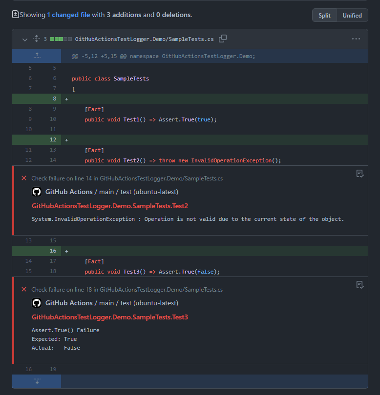

# GitHubActionsTestLogger

[](https://github.com/Tyrrrz/GitHubActionsTestLogger/actions)
[](https://nuget.org/packages/GitHubActionsTestLogger)
[](https://nuget.org/packages/GitHubActionsTestLogger)
[](https://tyrrrz.me/donate)

Custom test logger for `dotnet test` that writes output in a structured format which is understood by GitHub Actions. When using this logger, failed tests show up in diffs as well as in the list of annotations.

## Download

- [NuGet](https://nuget.org/packages/GitHubActionsTestLogger): `dotnet add package GitHubActionsTestLogger`

## Screenshots

Failed tests are highlighted in diffs:



Failed tests are listed in annotations:


## Usage

Prerequisites:

- .NET SDK v3.0 or higher
- Latest version of `Microsoft.NET.Test.Sdk` referenced in your test project

Setup:

1. Install `GitHubActionsTestLogger` in your test project via NuGet

2. Update your workflow by adding a logger option to `dotnet test`:

```yaml
steps:
  # ...

  - name: Build & test
    run: dotnet test --logger GitHubActions
```

### Ignore warnings

By default, GitHubActionsTestLogger produces warnings for tests that have neither failed nor succeeded (e.g. skipped). If you don't want that, you can disable it with a parameter:

```sh
dotnet test --logger "GitHubActions;report-warnings=false"
```
